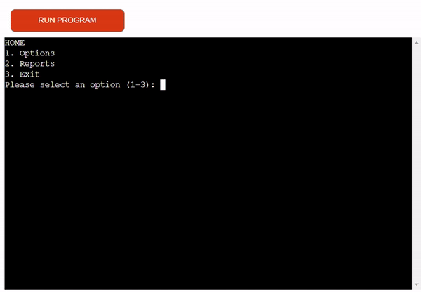
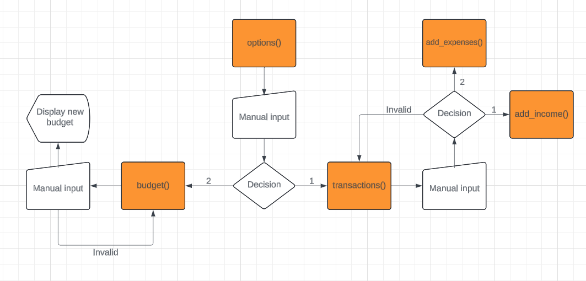

# Personal Finance Tool

******

## Contents

******

## The User Experience

This project was created to help people manage finances better and more easily by categorizing different incomes and expenses. It also allows you to set a monthly budget and see reports within certain date ranges or for the previous month.

### Site Goals

* To provide data to allow for more calculated decisions on spending and budgeting.

### Target Audience

* For people who are looking to know exactly where their money is coming and going.

### User Stories

* As a User, I would like to be able to easily find the various menus so that I can view information or add information.
* As a User, I would like to be able to add a new income and expense
* As a User, I would like to be able to set a monthly budget
* As a User, I would like to be able to see my income and expenses over a specified range
* As a User, I would like to see a summary for the previous month
* As a User, I would like to see an analysis of a specified date range
* As a User, I would like to be able to return to the main menu without having to restart the application.

******

## Workflow Diagrams

#### Main menu

#### Options

#### Reports

[*Back to top*](#contents)

******

## Structure

### Features

USER STORY

`
As a User, I would like to be able to easily find the various menus so that I can view information or add information.
`

IMPLEMENTATION
* Main Menu
    * Here the user can select between the following options:
        * 1 - Options - This option will navigate the user to the options menu
        * 2 - Reports  - This option will navigate the user to the reports menu
        * 3 - Exit - This option will exit the application/programme
    * The user must input a correct number corresponding to each menu or they will be alerted of an incorrect choice and the menu will be presented again. This is the same for all menus.

USER STORY

`
As a User, I would like to be able to add a new income and expense
`

IMPLEMENTATION
* New Transaction menu
    * Here the user can select between the following options:
        * 1 - Add Income - This option will ask for user input, once all the data is collected it will save to the google sheets worksheet.
        * 2 - Add Expense - This option will ask for user input, once all the data is collected it will save to the google sheets worksheet.
        * 3 - Go Back - This option will return the user to the Options menu.
        * 4 - Exit - This option will exit the application/programme
    * The user can will be prompted to enter a number for the value of there income or expense depending on the option chosen and a category. They can then enter the value and press enter to upload there new data to the google worksheet.

USER STORY

`
As a User, I would like to be able to set a monthly budget
`

IMPLEMENTATION
* Options Menu
    * Here the user has the following options:
        * 1 - New Transaction - This option will send the user to the New Transaction menu
        * 2 - Edit monthly budget - This option will display the current monthly budget and ask for user input, once all the data is collected it will save to the google sheet worksheet under monthly budget.
        * 3 - Go Back - This option will return the user to the Main menu
        * 4 - Exit - This option will exit the application/programme
    * When the user chooses the edit monthly budget option they will be able to see there current monthly budget and edit it.

USER STORY

`
As a User, I would like to be able to see my income and expenses over a specified range
`

IMPLEMENTATION
* Reports menu
    * Here the user has the following options:
        * 1 - Income - The user will be prompted for multiple inputs , the appropriate data is then displayed 
        * 2 - Expenses - The user will be prompted for multiple inputs , the appropriate data is then displayed 
        * 3 - Summary - A monthly summary will be displayed for the previous month
        * 4 - Analytics - The user will be prompted for multiple inputs and will then be shown a display of there spending habits over a specified range
        * 5 - Go Back - This will take the user back to the previous menu
        * 6 - Exit - This option will exit the application/programme
    * When the income or expenses option is selected the user will be prompted to input a date range, after a correct date range in inputted they will be displayed with the appropriate information

USER STORY

`
As a User, I would like to see a summary for the previous month
`

IMPLEMENTATION
* Reports menu
    * Here the user has the following options:
        * 1 - Income - The user will be prompted for multiple inputs , the data is then saved to the google worksheet
        * 2 - Expenses - The user will be prompted for multiple inputs , the data is then saved to the google worksheet
        * 3 - Summary - A monthly summary will be displayed for the previous month
        * 4 - Analytics - The user will be prompted for multiple inputs and will then be shown a display of there spending habits over a specified range
        * 5 - Go Back - This will take the user back to the previous menu
        * 6 - Exit - This option will exit the application/programme
    * When the summary option is selected the summary for the previous month will be displayed

USER STORY

`
As a User, I would like to see an analysis of a specified date range 
`

IMPLEMENTATION
* Reports menu
    * Here the user has the following options:
        * 1 - Income - The user will be prompted for multiple inputs , the data is then saved to the google worksheet
        * 2 - Expenses - The user will be prompted for multiple inputs , the data is then saved to the google worksheet
        * 3 - Summary - A monthly summary will be displayed for the previous month
        * 4 - Analytics - The user will be prompted for multiple inputs and will then be shown a display of there spending habits over a specified range
        * 5 - Go Back - This will take the user back to the previous menu
        * 6 - Exit - This option will exit the application/programme
    * When the analytics option is selected the user would be prompted to input a date range, when a correct date range is entered a display of analytics for the users spending will be presented.

USER STORY

`
As a User, I would like to be able to return to the main menu without having to restart the application.
`

IMPLEMENTATION
Across all the menus there is an option to return to the previous menu which you can do until you get back to the main menu.
The user must input the correct corresponding number in order to return to the previous menu.

### Features left to implement

A future feature I would like to add, Improving the analytics report to show spending against the monthly budget and to be able to add recurring income/expenses that happen every month from specified dates. This would minimize the amount the user will have to interact with the app making it less of a task.

[*Back to top*](#contents)

******

## Technologies Used

* Python - Python was the main language used to build the application.
    * Python packages used:
        * DateTime - To validate dates
        * Colorama - To color outputs
        * Tabulate - Used to create a table output
        * gspread - Used to read/write to google worksheets
* Google sheets - This was used as data storage in order to store transaction history and other information.
* Microsoft Snipping tool - This was used to screen record the Gif for the readme. It was originally an MP4 and ezgif.com was used to convert to GIF format.

[*Back to top*](#contents)

******

## Deployment and Local Development

### Deployment

This project was deployed using Code Institute's mock terminal for Heroku.

The steps for deployment are:

    1. Create a new Heroku app with a unique name and the region

    2. In the "settings" tab, set the build packs to 'Python' and 'NodeJS' (the order is important)

    3. Link the Heroku app to the GitHub repository

    4. In case it is wished, enable "automatic deploys" to automatically update the app in case of a new commit

    5. Click on Deploy in the "manual deploy" area

******

### Local Deployment

#### How to Fork

1. Log in to [GitHub](https://github.com/).

2. Find the repository for [this project](https://github.com/Jxkeorton/personal-finance).

3. Click the Fork button in the top right corner of the screen.

#### How to Clone

1. Log in to [GitHub](https://github.com/).

2. Find the repository for [this project](https://github.com/Jxkeorton/personal-finance).

3. Click the Code button and select whether you would like to clone with HTTPS, SSH or GitHub CLI. Copy the link displayed.

4. Open the terminal in your code editor and change the current working directory to the location you want to use for the cloned directory.

5. Type 'git clone' into the terminal and then paste the link you copied in step 3.

[*Back to top*](#contents)

******

## Testing

### Pep8 Validation

******

### Functional Testing

[*Back to top*](#contents)

## Issues/Bugs

### Fixed Issues

### Known Bugs

No known bugs at this stage of development.

[*Back to top*](#contents)

******

## Credits

[*Back to top*](#contents)